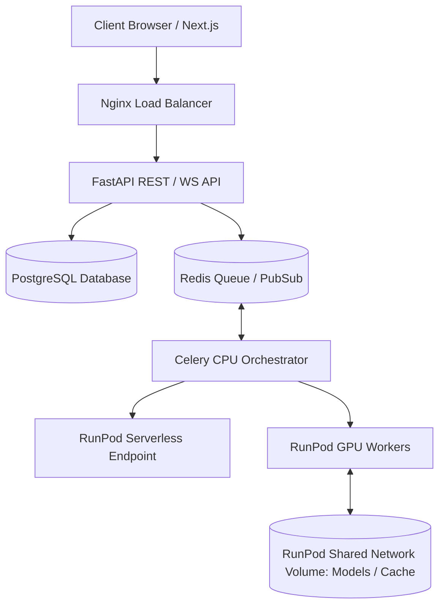

# Deploying ShadowReel AI on RunPod

This guide outlines deploying ShadowReel's GPU-intensive video and image generation workers on [RunPod](https://runpod.io). We cover both **RunPod Serverless** (best for on-demand cost efficiency) and **RunPod Network Volumes** with Pods (best for high-throughput persistent workers).

---

## 1. Architecture Overview on RunPod



---

## 2. Using RunPod Shared Network Volumes (Recommended)

Since FLUX.1 and Wan2.1 models require up to 30GB of storage and high VRAM, storing model weights on a **Shared Network Volume** avoids downloading model weights every time a container restarts.

### Step 1: Create a Network Volume
1. Go to the RunPod Console -> **Storage**.
2. Click **Create Volume**.
3. Select a Data Center region (e.g., `us-east-1`).
4. Set the size (at least **100 GB** to accommodate FLUX, Wan2.1, and ComfyUI cache).
5. Name the volume `shadowreel-model-cache`.

### Step 2: Download Model Weights to the Volume
Deploy a temporary GPU pod (e.g., RTX 4090) and mount the network volume to `/workspace`. Run these commands in the terminal:

```bash
# Navigate to the network volume mount
cd /workspace

# Create model directory structures
mkdir -p models/unet models/vae models/clip models/loras models/checkpoints

# Download FLUX.1 dev weights
wget -O models/unet/flux1-dev.sft https://huggingface.co/black-forest-labs/FLUX.1-dev/resolve/main/flux1-dev.sft

# Download Wan2.1 video weights
wget -O models/unet/wan2.1_i2v_720p_1.3B.sft https://huggingface.co/Wan-AI/Wan2.1-I2V-14B-720P/resolve/main/wan2.1_i2v_720p_1.3B.sft
```

### Step 3: Deploy GPU Workers with Volume Mounts
Deploy the ShadowReel Celery GPU worker containers:
* **Image**: `yourdockerhub/shadowreel-backend:latest`
* **Docker Command**: `celery -A workers.celery_app worker --loglevel=info -Q video,image --concurrency=1`
* **Volume Mount**: Mount `/workspace` from `shadowreel-model-cache` to `/models` inside the container.
* **Environment Variables**:
  ```env
  COMFYUI_HOST=localhost
  COMFYUI_PORT=8188
  REDIS_HOST=your-redis-ip
  REDIS_PORT=6379
  POSTGRES_HOST=your-postgres-ip
  USE_SQLITE=false
  USE_FAKE_REDIS=false
  COMFYUI_MODEL_DIR=/models
  ```

---

## 3. Deploying as RunPod Serverless

For maximum scalability, ComfyUI generation pipelines can run as serverless workers.

### Step 1: Prepare the Serverless Handler
Create a serverless entry point wrapping ComfyUI prompts:
```python
import runpod
from services.workflows.comfy_tuner import ComfyUIWorkflowTuner
# Call ComfyUI API inside handler

def handler(event):
    # event["input"] contains prompt params
    return {"status": "success", "output_url": "https://cdn.shadowreel.ai/..."}

runpod.serverless.start({"handler": handler})
```

### Step 2: Build the Serverless Docker Container
Your `Dockerfile.serverless` should inherit from PyTorch CUDA images:
```dockerfile
FROM runpod/pytorch:2.2.0-py3.10-cuda12.1.1-devel-ubuntu22.04

# Copy weights locally or mount network volume
COPY models/ /models/

# Install handler
COPY . .
RUN pip install runpod httpx websockets

CMD [ "python", "-u", "/handler.py" ]
```

### Step 3: Deploy on RunPod Serverless Dashboard
1. Go to **Serverless** -> **Templates** -> **New Template**.
2. Set the image path and request size (recommend **24GB VRAM** e.g., RTX 3090/4090 tier).
3. Set **Active Count** minimum to `0` (or `1` to avoid cold starts).
4. Save and copy the **Endpoint ID**.

### Step 4: Configure ShadowReel API to use Serverless API
In your `.env` file, specify:
```env
RUNPOD_SERVERLESS_ENDPOINT_ID=your-endpoint-id
RUNPOD_API_KEY=your-runpod-api-key
```
The celery worker will automatically route generation jobs to the RunPod Serverless API when ComfyUI is configured to `runpod://` endpoint.

---

## 4. Hardware Sizing Recommendations

| Pipeline Type | GPU Hardware | Min VRAM | Min System RAM |
| :--- | :--- | :--- | :--- |
| **FLUX Image Gen Only** | 1x RTX 4000 SFF / RTX 3080 | 12 GB | 16 GB |
| **Wan2.1 Video Gen Only**| 1x RTX 3090 / 4090 | 24 GB | 32 GB |
| **Unified Cinematic Node**| 1x A100 (80GB) / H100 | 80 GB | 64 GB |
